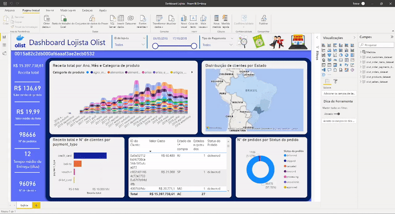

# Pipeline do Airflow para análise de dados e Dashboard

Este projeto foi desenvolvido na primeira edição da competição educativa Stack Labs, da Stack Tecnologias, em que squads de alunos da plataforma da Stack se reuniram em squads para desenvolver projetos de ciência e engenharia de dados a fim de exercitar os conhecimentos adquiridos nos cursos da Stack Tecnologias em um projeto prático utilizando dados da Olist disponíveis em: [Fonte dos dados utilizados no projeto](https://www.kaggle.com/olistbr/brazilian-ecommerce); neste projeto fiquei responsável pela parte de visualização de dados e dashboards que solucionassem as questões de negócio levantadas pelo grupo:

